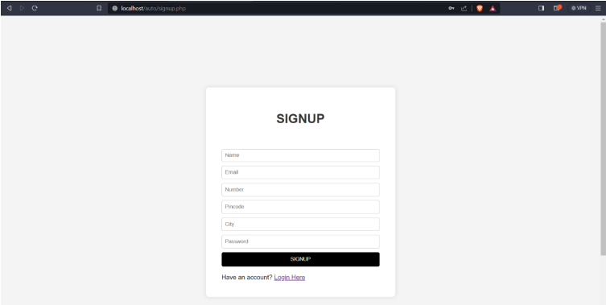

# 🚖 Rickshawala – Auto Rickshaw Finder Web App

**Rickshawala** is a web-based application designed to help users search for available auto rickshaws in their area using a pincode. It allows users to view the availability status of drivers, and includes secure login systems for both drivers and administrators. Built with PHP, MySQL, HTML, CSS, and JavaScript, and hosted locally using XAMPP.

---

## 🌐 Live Preview

> Since this is a local web app, it runs on **localhost** via **XAMPP** and is not hosted publicly.

---

## 📌 Features

- 🔎 **Search rickshaws** by pincode
- ✅ View **availability** status (Active/Inactive)
- 👤 **Driver registration** and login
- 🧾 Driver profile page with update availability option
- 🔐 **Admin login** with driver management capabilities
- 💡 Simple UI built with HTML & CSS
- 💻 Local server setup using PHP and MySQL

---

## 🧰 Tech Stack

| Frontend   | Backend     | Database | Hosting |
|------------|-------------|----------|---------|
| HTML, CSS  | PHP         | MySQL    | XAMPP   |

---

## 🛠️ How to Run Locally

1. Download and install [XAMPP](https://www.apachefriends.org/index.html).
2. Clone or download this repo into your `htdocs/` folder.
3. Start Apache and MySQL from the XAMPP Control Panel.
4. Import the SQL database into phpMyAdmin:
   - Open `http://localhost/phpmyadmin`
   - Create a database named `rickshawala`
   - Import the `.sql` file (provided in `db/` folder if applicable)
5. Visit `http://localhost/rickshawala/index.html` in your browser.

---

## 🧪 Screenshots

- Home/Search Page  
  

- Driver Login Page  
  

- Signup Page  
  

---

## ✅ Result

The system simplifies real-time auto driver discovery based on location (pincode) and offers an easy-to-use dashboard for both users and drivers. Admins can manage all driver accounts via a dedicated login.

---

## 📌 Conclusion

**Rickshawala** aims to bridge the communication gap between passengers and auto rickshaw drivers by using simple, accessible technology. It provides a transparent, efficient platform for local transportation discovery.

